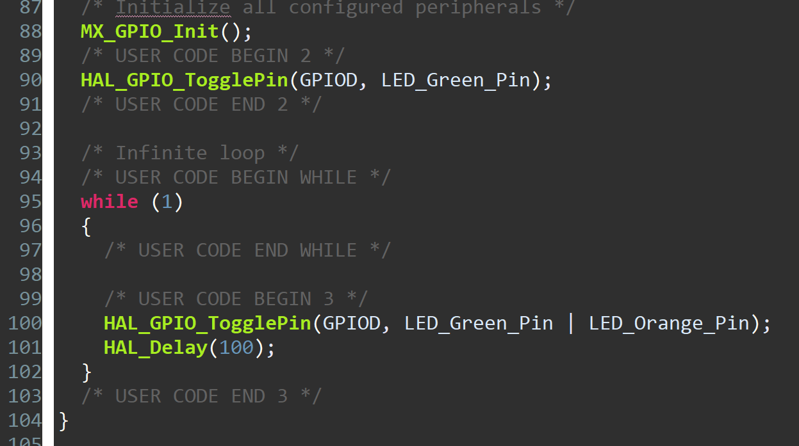
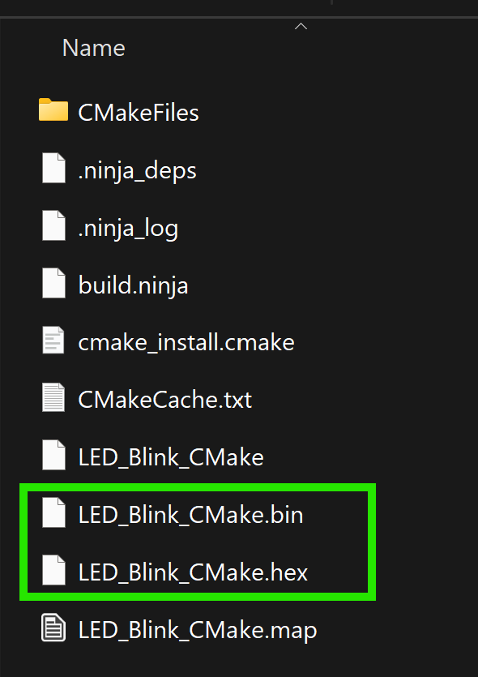
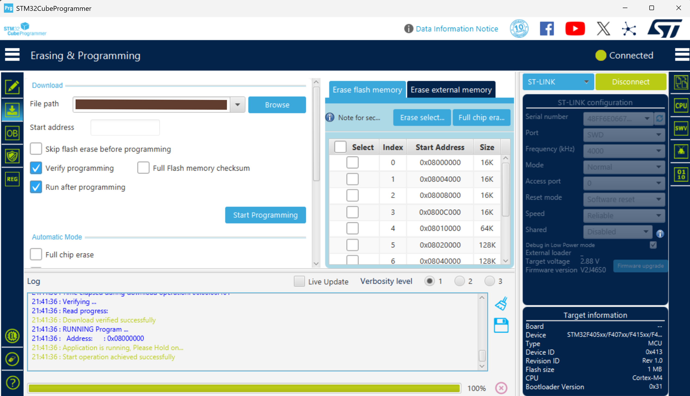

## Tools required and setup
- Install *MSYS2*. After installing *MSYS2*, use *MSYS2 MINGW64 Shell*. All required tools can then be installed in the *MSYS2*.
- Update the *MSYS2* packages: `pacman -Sy`
- Install CMake: `pacman -S cmake`
- Install Ninja: `pacman -S ninja`
- Windows tool to compile code for ARM microcontrollers: `pacman -S mingw-w64-x86_64-arm-none-eabi-gcc`

## Generate project using *STM32CubeIDE*
1. Create *STM32 Project* in *STM32CubeIDE*, and generate code.
2. Write code as required. In this example, code for blinking LEDs is written as below:  

3. Write code/commands in *CMakeLists.txt* file in the root fodler of the project.

## Generate build files and executable:
Note: Below commands must be run from *MSYS2 MINGW64 Shell*.
- Generate Ninja files: `cmake -Bbuild -GNinja -DCMAKE_C_COMPILER=arm-none-eabi-gcc -DCMAKE_ASM_COMPILER=arm-none-eabi-gcc -DCMAKE_BUILD_TYPE=Debug .`
- Build executable: `cmake --build build`

  After building project, executable files can be found inside the *build* folder as in figure below, which can be flashed into the MCU.  
  

- Remove build fodler (Can be helpful when something went wrong while building project.): `rm -rf build/`

## Flash the executables into the MCU
*STM32CubeProgrammer* can be used to flash the executable into the MCU:  

