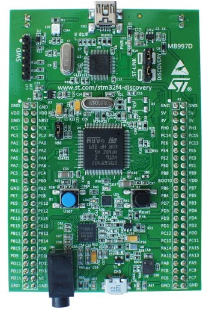

# STM32F4-Discovery-Board
 ### Here I have put some Examples for STM32F4-Discovery-Board.

**Description:**
 - board used: STM32F407VG [link: https://www.st.com/en/evaluation-tools/stm32f4discovery.html]  
 - for Projects with Atollic TrueSTUDIO: main file is saved at location '<project-name>\src\main.c'  
 - for Projects with STM32CubeIDE: main file is saved at location '<project-name>\Core\Src\main.c'  
 
### Projects and IDE used:

| S.No. | Project                           | IDE Used           |
|-------|-----------------------------------|--------------------|
| 1     | LED_Blink                         | Atollic TrueSTUDIO |
| 2     | RNG                               | Atollic TrueSTUDIO |
| 3     | EXTI_Interrupt_PushButton_OnBoard | Atollic TrueSTUDIO |
| 4     | Timer_TIM10                       | Atollic TrueSTUDIO |
| 5     | USART                             | Atollic TrueSTUDIO |
| 6     | ADC_onboardTemperatureSensor      | Atollic TrueSTUDIO |
| 7     | ADC_OnBoard3VPinRead              | STM32CubeIDE       |
| 8     | IIC_Master                        | STM32CubeIDE       |
| 9     | IIC_Slave                         | STM32CubeIDE       |
| 10    | CAN                               | Atollic TrueSTUDIO |
| 11    | USB_Device_CDC                    | STM32CubeIDE       |

#### USB_Device_CDC
- USB Port (micro-USB) available on the discovery board

### STM32F4-Discovery Board

